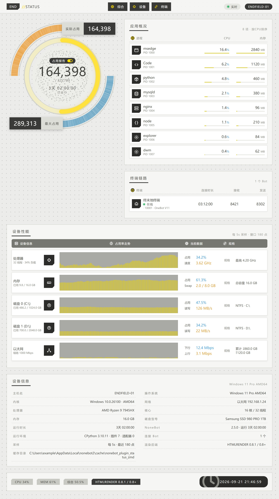
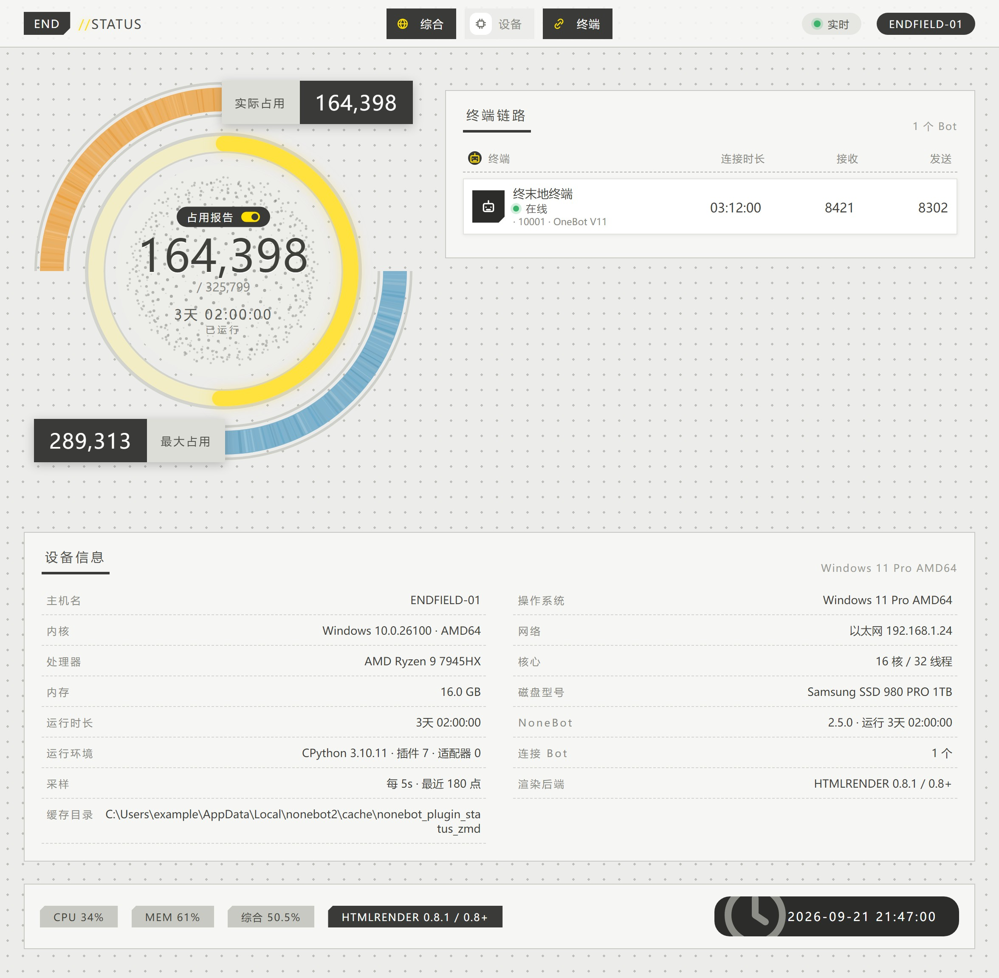
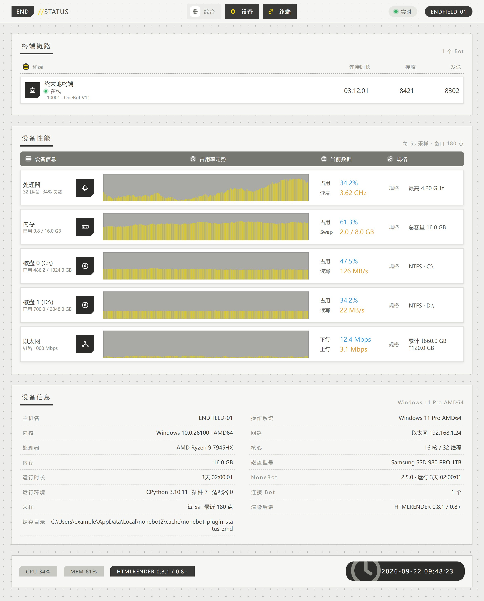

<div align="center">
    <a href="https://v2.nonebot.dev/store">
    </a>

## ✨ NoneBot-Plugin-Status-zmd ✨


 以《明日方舟：终末地》协议核心面板风格展示服务器运行状态的 NoneBot2 插件 

<p>
    
    
</p>

</div>

## 📖 介绍

发一条 `status`，得到一张协议核心面板风格的设备状态图：圆形电量环 + 设备性能走势 + 应用概况 + 终端链路 + 设备信息表。

### 📷 效果图

<details>
<summary>点击展开</summary>

**`STZMD_LAYOUT=full`** —— 综合长图（默认）



**`STZMD_LAYOUT=gauge`** —— 只出电量环



**`STZMD_LAYOUT=perf`** —— 只出设备性能


</details>

## 💿 安装

<details open>
<summary>使用 nb-cli 安装</summary>
在 nonebot2 项目的根目录下打开命令行, 输入以下指令安装（暂未上架，请先使用包管理器安装）

    nb plugin install nonebot-plugin-status-zmd

</details>


<details>
<summary>使用包管理器安装</summary>

```bash
pip install nonebot-plugin-status-zmd
```

在 `pyproject.toml` 中添加：

```toml
[tool.nonebot]
plugins = ["nonebot_plugin_status_zmd"]
```

</details>

> 需要 **nonebot2 >= 2.3.0**。2.3 上依赖会解析到偏低的一套（`alconna 0.59` /
> `uninfo 0.6` / `htmlrender 0.6.3`），2.5 上则是最新的一套，两套都已实测。

### ⚠️ 渲染后端

插件通过 `nonebot-plugin-htmlrender` 渲染页面，**0.6 / 0.7 / 0.8+ 都支持**，
但从 0.8 起它不再内置浏览器后端，需要额外两步：

```bash
# htmlrender >= 0.8：装 Playwright 后端（0.6 / 0.7 自带，跳过这步）
pip install "nonebot-plugin-htmlrender[playwright]>=0.8"
# 或装本插件提供的配套 extra（等价）
pip install "/path/to/nonebot-plugin-status-zmd[htmlrender8]"

# 任一版本都需要浏览器内核
playwright install chromium
# Debian/Ubuntu、容器、CI 建议带上系统依赖
playwright install --with-deps chromium
```

```properties
# htmlrender >= 0.8 还需要在 .env 里选 Provider（0.6 / 0.7 不用）
RENDER={"provider":"playwright","startup":"warmup"}
```

> 另外 htmlrender 0.7 起把浏览器目录搬到了 localstore 数据目录（首次启动的日志里
> 会打印具体路径）。如果出图报 `Executable doesn't exist`，把
> `PLAYWRIGHT_BROWSERS_PATH` 指到那个目录再装一次即可，例如：
>
> ```bash
> set "PLAYWRIGHT_BROWSERS_PATH=%LOCALAPPDATA%\nonebot2\nonebot_plugin_htmlrender"
> playwright install chromium
> ```

后端不可用时插件**不会**启动失败，而是打印一条带修复步骤的告警，并在指令触发时
把同样的提示发给使用者。

## 🎉 使用

```text
status
系统状态
```

指令名可用 `STZMD_COMMAND` 修改。默认**仅 SUPERUSER**可用（状态图含主机名、IP、
进程、磁盘等信息，不适合公开）。

> NoneBot 默认只把 `/` 开头的消息当命令，想直接发 `status` 触发，需要把空字符串
> 加进 `COMMAND_START`：
>
> ```properties
> COMMAND_START=["", "/"]
> ```

## ⚙️ 配置

### 全部配置项见 [.env.example](.env.example)

常用几项：

| 配置项 | 默认值 | 说明 |
| --- | --- | --- |
| `STZMD_LAYOUT` | `full` | `full` 综合长图 / `gauge` 只出电量环 / `perf` 只出设备性能 |
| `STZMD_BLOCKS` | 全部 | 板块开关：`header` `gauge` `apps` `bots` `perf` `specs` `footer` |
| `STZMD_DEVICES` | `cpu mem disk net` | 设备性能区逐设备开关，列表顺序即图上顺序 |
| `STZMD_COMMAND` | `["status", "系统状态"]` | 触发指令，第一个为主指令，其余为别名 |
| `STZMD_ONLY_SUPERUSER` | `true` | 是否仅 SUPERUSER 可用 |
| `STZMD_NEED_AT` | `false` | 是否需要 @ 机器人才能触发 |
| `STZMD_REPLY_TARGET` | `true` | 是否回复触发者那条消息 |
| `STZMD_HOST_NAME` | 空 | 顶栏显示的主机名，留空用系统主机名 |
| `STZMD_GAUGE_VALUE_MAX` | `325799` | 电量环分母（终末地的游戏口径） |
| `STZMD_GAUGE_CPU_WEIGHT` / `STZMD_GAUGE_MEM_WEIGHT` | `0.4` / `0.6` | 电量环综合占用的 CPU / 内存权重 |
| `STZMD_COLLECT_INTERVAL` | `5` | 后台采样间隔（秒） |
| `STZMD_HISTORY_SIZE` | `180` | 走势图保留的采样点数（窗口 = 间隔 × 点数） |
| `STZMD_COLLECT_TIMEOUT` | `15` | 单次采集等待上限（秒），超时先继续、不拖住启动 |
| `STZMD_PIC_FORMAT` / `STZMD_PIC_QUALITY` | `jpeg` / `90` | 出图格式与质量 |
| `STZMD_DEVICE_SCALE_FACTOR` | `2` | 出图缩放倍率，图更清晰、体积更大 |
| `STZMD_FONT_FAMILY` | 空 | 指定 CSS 字体栈，例如 `"Noto Sans CJK SC"` |
| `STZMD_FONT_PATH` | 空 | 指定字体文件并内联进图片（≤ 8MB），保证字形一致 |
| `STZMD_IGNORE_PARTS` / `STZMD_IGNORE_NETS` / `STZMD_IGNORE_PROCS` | 见 .env.example | 忽略的分区 / 网卡 / 进程（正则） |

### 版式与板块的关系

`STZMD_LAYOUT` 决定整体容器结构，`STZMD_BLOCKS` 决定渲染哪些板块，只有两者都允许的
板块才会出现：

| 版式 | 允许的板块 |
| --- | --- |
| `full` | 全部：顶栏 +（电量环 \| 应用概况+终端链路）+ 设备性能 + 设备信息 + 底栏 |
| `gauge` | 顶栏 + 电量环 + 终端链路 + 设备信息 + 底栏 |
| `perf` | 顶栏 + 设备性能 + 终端链路 + 设备信息 + 底栏 |

各板块对应图上哪一块：

| 板块 | 内容 |
| --- | --- |
| `header` | 顶栏：主机名、系统、采样间隔与历史窗口 |
| `gauge` | 电量环：综合占用、CPU / 内存占比、运行时长 |
| `apps` | 应用概况：进程的 CPU / 内存占用条（按 `STZMD_PROC_SORT_BY` 排序取前 `STZMD_PROC_LEN` 个） |
| `bots` | 终端链路：Bot 列表与头像、连接时长、收发计数、NoneBot 版本与插件数 |
| `perf` | 设备性能：走势柱 + 当前占用 + 速度 + 规格 |
| `specs` | 设备信息表（底部） |
| `footer` | 底栏：生成时间、渲染后端 |

### 设备性能区出哪几行

`STZMD_DEVICES` 控制设备性能区里出哪几行（可只留 `["cpu", "mem"]` 做轻量监控，
或 `["net"]` 只看网络）：

| 取值 | 对应行 |
| --- | --- |
| `cpu` | 处理器（占用 / 频率 / 最高频率） |
| `mem` | 内存（占用 / Swap / 总容量） |
| `disk` | 每个分区一行（容量占用 / 读写 / 文件系统），受 `STZMD_IGNORE_PARTS` 过滤 |
| `net` | 每张网卡一行（下行 / 上行 / 链路），受 `STZMD_IGNORE_NETS` 过滤 |

> 不含 GPU：显卡指标跨平台差异太大，本插件不采集。

### 启动期采集超时

宿主机的挂载点失联时（比如掉线的网络盘），采集可能阻塞很久。启动期（静态信息 +
基准 + 首采）**共用一份** `STZMD_COLLECT_TIMEOUT` 总预算：超时**不会**中断采集，
只是先放行——机器人照常启动，数据由下个采样周期补上；若出图时仍没有数据，会直接回
一句「状态数据还没准备好」而不是卡住。


## 💡 鸣谢

### [QinAnze/zmd-manager](https://github.com/QinAnze/zmd-manager)

- UI视觉规范参考：电量环、配色、点阵底纹、走势柱、切角图标块

### [lgc-NB2Dev/nonebot-plugin-picstatus](https://github.com/lgc-NB2Dev/nonebot-plugin-picstatus)

- 采集器组织方式、渲染管线与「指令带图」的整体思路

### [kexue-z/nonebot-plugin-htmlrender](https://github.com/kexue-z/nonebot-plugin-htmlrender)

- HTML 渲染后端

### [nonebot/plugin-alconna](https://github.com/nonebot/plugin-alconna)

- 多平台指令解析与发送

## 📄 许可

MIT